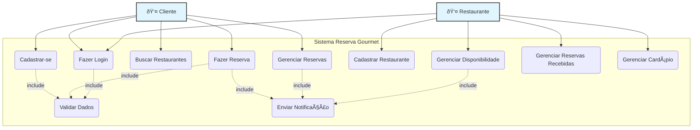

```mermaid

graph TB
    %% Atores
    Cliente[👤 Cliente]
    Restaurante[👤 Restaurante]
    
    %% Casos de Uso
    subgraph Sistema["Sistema Reserva Gourmet"]
        UC01("Cadastrar-se")
        UC02("Fazer Login")
        UC03("Buscar Restaurantes")
        UC04("Fazer Reserva")
        UC05("Gerenciar Reservas")
        UC06("Cadastrar Restaurante")
        UC07("Gerenciar Disponibilidade")
        UC08("Gerenciar Reservas Recebidas")
        UC09("Gerenciar Cardápio")
        UC10("Validar Dados")
        UC11("Enviar Notificação")
    end
    
    %% Relacionamentos Cliente
    Cliente --> UC01
    Cliente --> UC02
    Cliente --> UC03
    Cliente --> UC04
    Cliente --> UC05
    
    %% Relacionamentos Restaurante
    Restaurante --> UC06
    Restaurante --> UC02
    Restaurante --> UC07
    Restaurante --> UC08
    Restaurante --> UC09
    
    %% Relacionamentos Include
    UC01 -.->|include| UC10
    UC04 -.->|include| UC10
    UC04 -.->|include| UC11
    UC05 -.->|include| UC11
    UC02 -.->|include| UC10
    UC07 -.->|include| UC11
    
    %% Estilo dos atores
    classDef ator fill:#e1f5ff,stroke:#333,stroke-width:2px
    class Cliente,Restaurante ator
```
