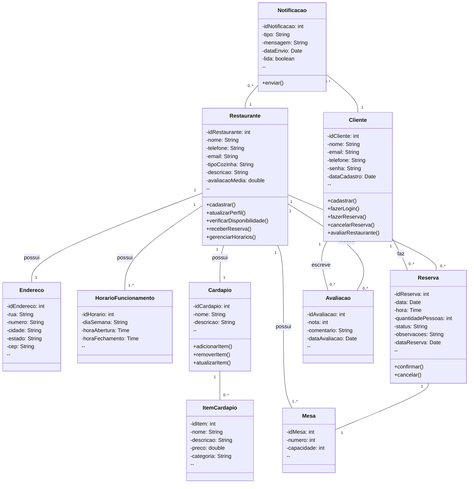

```mermaid

classDiagram
    direction TB

    class Cliente {
      -idCliente: int
      -nome: String
      -email: String
      -telefone: String
      -senha: String
      -dataCadastro: Date
      --
      +cadastrar()
      +fazerLogin()
      +fazerReserva()
      +cancelarReserva()
      +avaliarRestaurante()
    }

    class Restaurante {
      -idRestaurante: int
      -nome: String
      -telefone: String
      -email: String
      -tipoCozinha: String
      -descricao: String
      -avaliacaoMedia: double
      --
      +cadastrar()
      +atualizarPerfil()
      +verificarDisponibilidade()
      +receberReserva()
      +gerenciarHorarios()
    }

    class Endereco {
      -idEndereco: int
      -rua: String
      -numero: String
      -cidade: String
      -estado: String
      -cep: String
      --
    }

    class HorarioFuncionamento {
      -idHorario: int
      -diaSemana: String
      -horaAbertura: Time
      -horaFechamento: Time
      --
    }

    class Reserva {
      -idReserva: int
      -data: Date
      -hora: Time
      -quantidadePessoas: int
      -status: String
      -observacoes: String
      -dataReserva: Date
      --
      +confirmar()
      +cancelar()
    }

    class Mesa {
      -idMesa: int
      -numero: int
      -capacidade: int
      --
    }

    class Cardapio {
      -idCardapio: int
      -nome: String
      -descricao: String
      --
      +adicionarItem()
      +removerItem()
      +atualizarItem()
    }

    class ItemCardapio {
      -idItem: int
      -nome: String
      -descricao: String
      -preco: double
      -categoria: String
      --
    }

    class Avaliacao {
      -idAvaliacao: int
      -nota: int
      -comentario: String
      -dataAvaliacao: Date
      --
    }

    class Notificacao {
      -idNotificacao: int
      -tipo: String
      -mensagem: String
      -dataEnvio: Date
      -lida: boolean
      --
      +enviar()
    }

    Cliente "1" -- "0..*" Reserva : faz
    Cliente "1" -- "0..*" Avaliacao : escreve
    
    Restaurante "1" -- "0..*" Reserva : recebe
    Restaurante "1" -- "1" Endereco : possui
    Restaurante "1" -- "1..*" Mesa : possui
    Restaurante "1" -- "1" Cardapio : possui
    Restaurante "1" -- "1..*" HorarioFuncionamento : possui
    Restaurante "1" -- "0..*" Avaliacao : recebe
    
    Cardapio "1" -- "0..*" ItemCardapio
    Reserva "1" -- "1" Mesa
    
    %% Notificações (relacionamento simples)
    Notificacao "0..*" -- "1" Cliente
    Notificacao "0..*" -- "1" Restaurante
```

