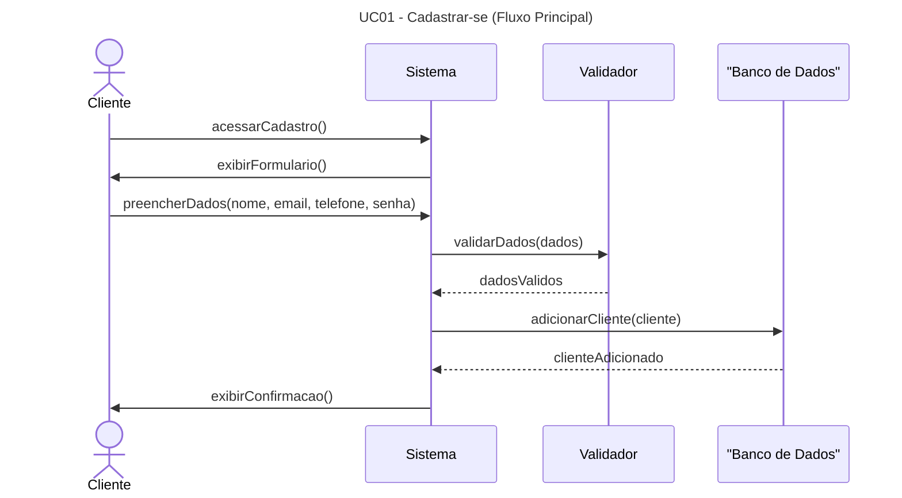
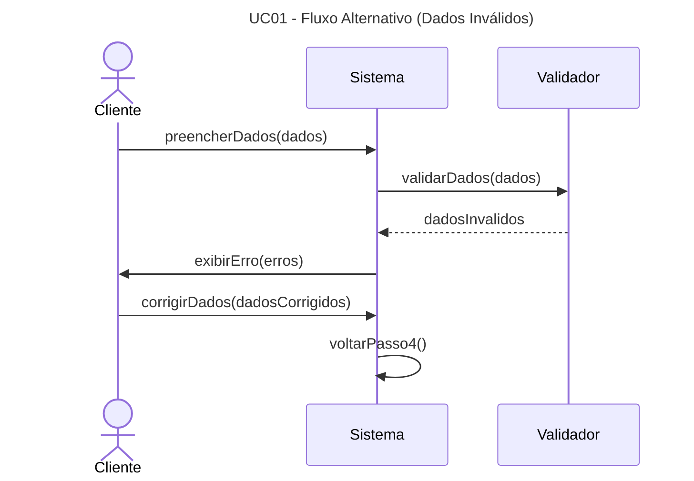

```mermaid
sequenceDiagram
    actor Cliente
    participant Sistema
    participant Validador
    participant BD as "Banco de Dados"
    
    title: UC01 - Cadastrar-se (Fluxo Principal)
    
    Cliente->>Sistema: acessarCadastro()
    Sistema->>Cliente: exibirFormulario()
    Cliente->>Sistema: preencherDados(nome, email, telefone, senha)
    Sistema->>Validador: validarDados(dados)
    Validador-->>Sistema: dadosValidos
    Sistema->>BD: adicionarCliente(cliente)
    BD-->>Sistema: clienteAdicionado
    Sistema->>Cliente: exibirConfirmacao()
```

```mermaid
sequenceDiagram
    actor Cliente
    participant Sistema
    participant Validador

    title: UC01 - Fluxo Alternativo (Dados Inválidos)
    
    Cliente->>Sistema: preencherDados(dados)
    Sistema->>Validador: validarDados(dados)
    Validador-->>Sistema: dadosInvalidos
    Sistema->>Cliente: exibirErro(erros)
    Cliente->>Sistema: corrigirDados(dadosCorrigidos)
    Sistema->>Sistema: voltarPasso4()
```
