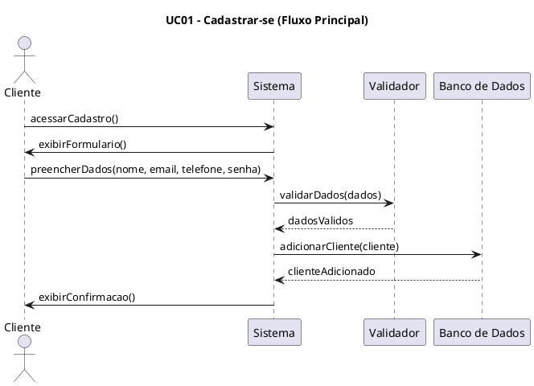

```plantuml

@startuml
actor Cliente
participant "Sistema" as Sistema
participant "Validador" as Validador
participant "Banco de Dados" as BD

title UC01 - Cadastrar-se (Fluxo Principal)

Cliente -> Sistema: acessarCadastro()
Sistema -> Cliente: exibirFormulario()
Cliente -> Sistema: preencherDados(nome, email, telefone, senha)
Sistema -> Validador: validarDados(dados)
Validador --> Sistema: dadosValidos
Sistema -> BD: adicionarCliente(cliente)
BD --> Sistema: clienteAdicionado
Sistema -> Cliente: exibirConfirmacao()

@enduml

@startuml
actor Cliente
participant "Sistema" as Sistema
participant "Validador" as Validador

title UC01 - Fluxo Alternativo (Dados Inválidos)

Cliente -> Sistema: preencherDados(dados)
Sistema -> Validador: validarDados(dados)
Validador --> Sistema: dadosInvalidos
Sistema -> Cliente: exibirErro(erros)
Cliente -> Sistema: corrigirDados(dadosCorrigidos)
Sistema -> Sistema: voltarPasso4()

@enduml
```
