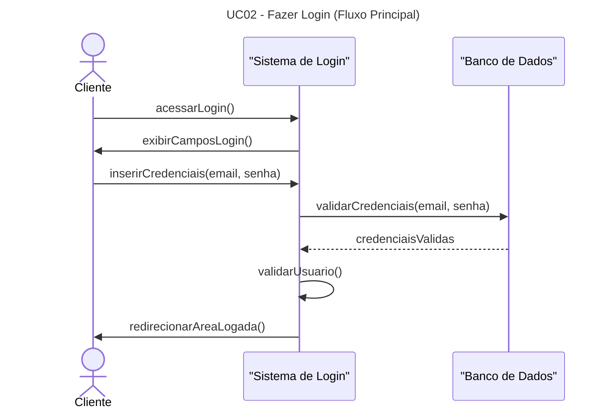
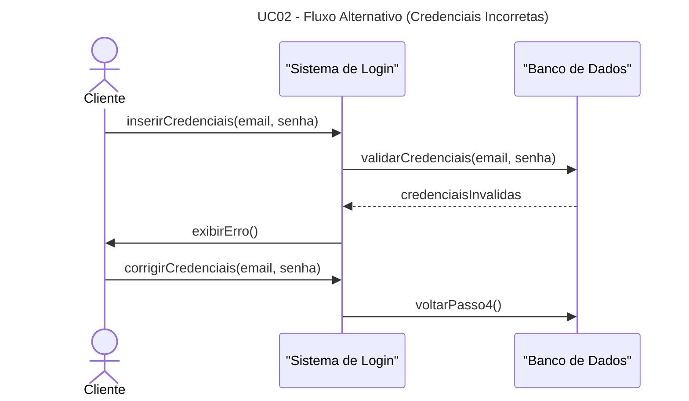

```mermaid
sequenceDiagram
    actor Cliente
    participant Login as "Sistema de Login"
    participant BD as "Banco de Dados"
    
    title: UC02 - Fazer Login (Fluxo Principal)
    
    Cliente->>Login: acessarLogin()
    Login->>Cliente: exibirCamposLogin()
    Cliente->>Login: inserirCredenciais(email, senha)
    Login->>BD: validarCredenciais(email, senha)
    BD-->>Login: credenciaisValidas
    Login->>Login: validarUsuario()
    Login->>Cliente: redirecionarAreaLogada()
```

```mermaid
sequenceDiagram
    actor Cliente
    participant Login as "Sistema de Login"
    participant BD as "Banco de Dados"

    title: UC02 - Fluxo Alternativo (Credenciais Incorretas)
    
    Cliente->>Login: inserirCredenciais(email, senha)
    Login->>BD: validarCredenciais(email, senha)
    BD-->>Login: credenciaisInvalidas
    Login->>Cliente: exibirErro()
    Cliente->>Login: corrigirCredenciais(email, senha)
    Login->>BD: voltarPasso4()
```
