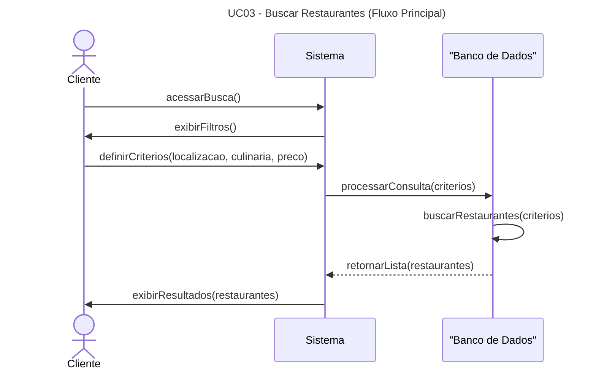
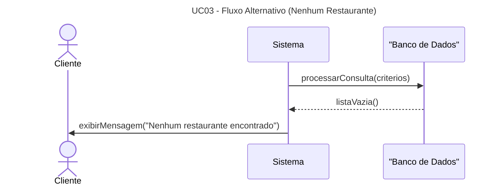

```mermaid
sequenceDiagram
    actor Cliente
    participant Sistema
    participant BD as "Banco de Dados"
    
    title: UC03 - Buscar Restaurantes (Fluxo Principal)
    
    Cliente->>Sistema: acessarBusca()
    Sistema->>Cliente: exibirFiltros()
    Cliente->>Sistema: definirCriterios(localizacao, culinaria, preco)
    Sistema->>BD: processarConsulta(criterios)
    BD->>BD: buscarRestaurantes(criterios)
    BD-->>Sistema: retornarLista(restaurantes)
    Sistema->>Cliente: exibirResultados(restaurantes)
```

```mermaid
sequenceDiagram
    actor Cliente
    participant Sistema
    participant BD as "Banco de Dados"

    title: UC03 - Fluxo Alternativo (Nenhum Restaurante)
    
    Sistema->>BD: processarConsulta(criterios)
    BD-->>Sistema: listaVazia()
    Sistema->>Cliente: exibirMensagem("Nenhum restaurante encontrado")
```
