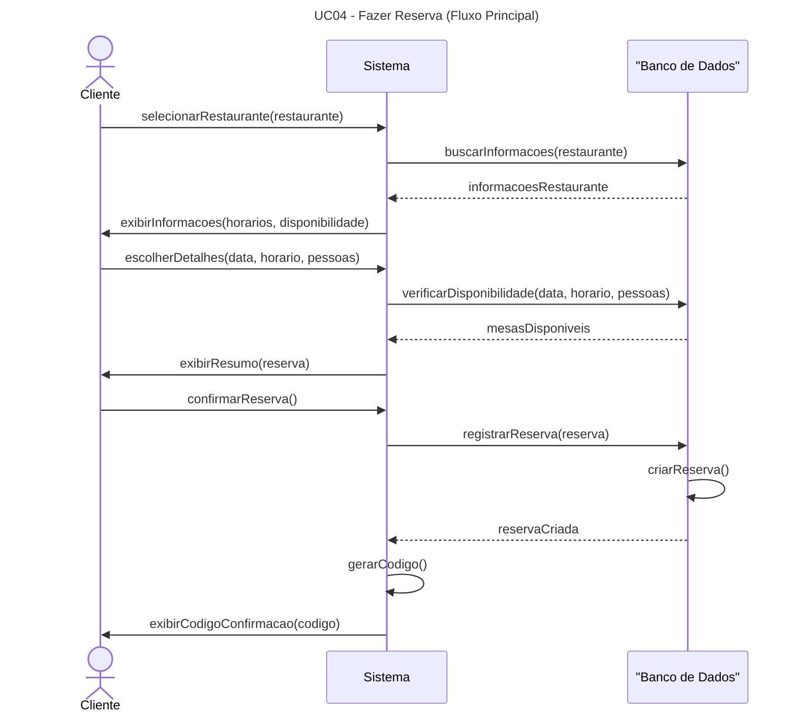
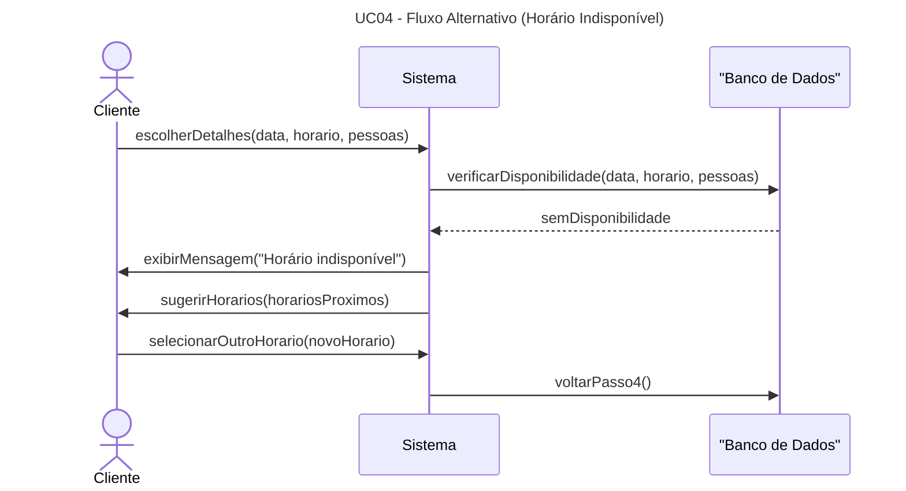

```mermaid
sequenceDiagram
    actor Cliente
    participant Sistema
    participant BD as "Banco de Dados"
    
    title: UC04 - Fazer Reserva (Fluxo Principal)
    
    Cliente->>Sistema: selecionarRestaurante(restaurante)
    Sistema->>BD: buscarInformacoes(restaurante)
    BD-->>Sistema: informacoesRestaurante
    Sistema->>Cliente: exibirInformacoes(horarios, disponibilidade)
    Cliente->>Sistema: escolherDetalhes(data, horario, pessoas)
    Sistema->>BD: verificarDisponibilidade(data, horario, pessoas)
    BD-->>Sistema: mesasDisponiveis
    Sistema->>Cliente: exibirResumo(reserva)
    Cliente->>Sistema: confirmarReserva()
    Sistema->>BD: registrarReserva(reserva)
    BD->>BD: criarReserva()
    BD-->>Sistema: reservaCriada
    Sistema->>Sistema: gerarCodigo()
    Sistema->>Cliente: exibirCodigoConfirmacao(codigo)
```

```mermaid
sequenceDiagram
    actor Cliente
    participant Sistema
    participant BD as "Banco de Dados"

    title: UC04 - Fluxo Alternativo (Horário Indisponível)
    
    Cliente->>Sistema: escolherDetalhes(data, horario, pessoas)
    Sistema->>BD: verificarDisponibilidade(data, horario, pessoas)
    BD-->>Sistema: semDisponibilidade
    Sistema->>Cliente: exibirMensagem("Horário indisponível")
    Sistema->>Cliente: sugerirHorarios(horariosProximos)
    Cliente->>Sistema: selecionarOutroHorario(novoHorario)
    Sistema->>BD: voltarPasso4()
```
