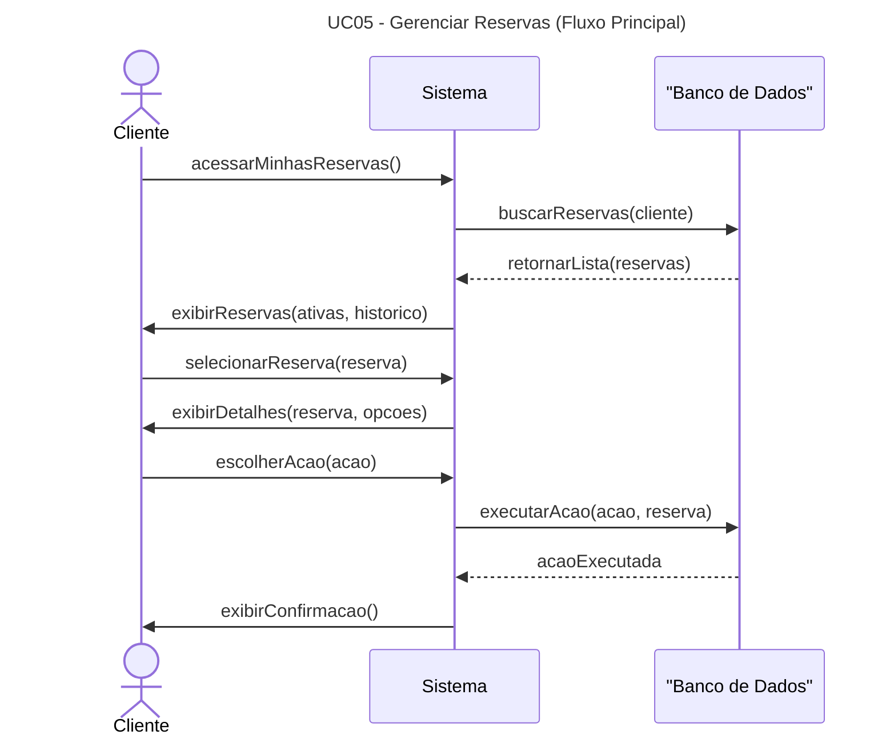
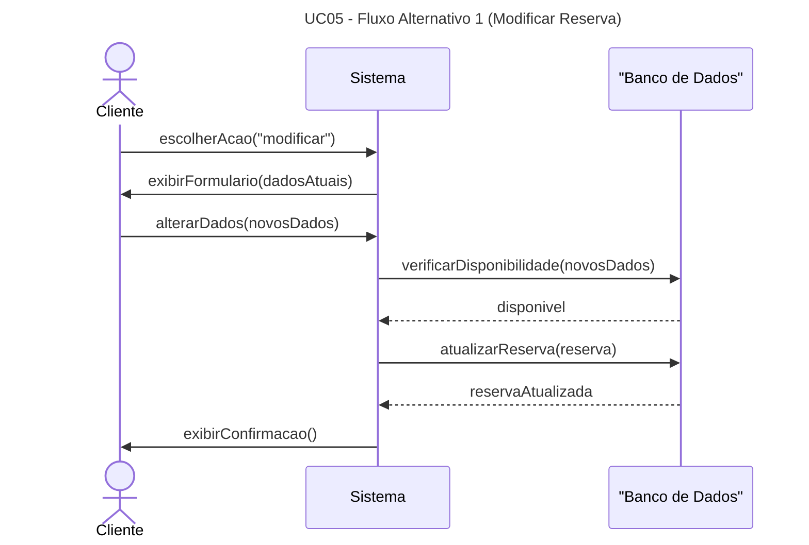
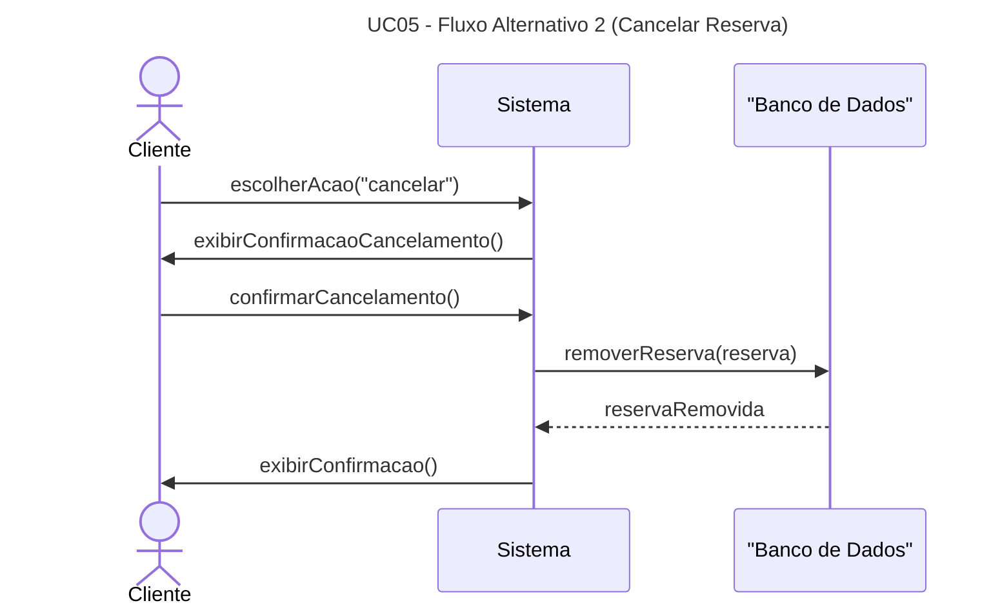

```mermaid
sequenceDiagram
    actor Cliente
    participant Sistema
    participant BD as "Banco de Dados"
    
    title: UC05 - Gerenciar Reservas (Fluxo Principal)
    
    Cliente->>Sistema: acessarMinhasReservas()
    Sistema->>BD: buscarReservas(cliente)
    BD-->>Sistema: retornarLista(reservas)
    Sistema->>Cliente: exibirReservas(ativas, historico)
    Cliente->>Sistema: selecionarReserva(reserva)
    Sistema->>Cliente: exibirDetalhes(reserva, opcoes)
    Cliente->>Sistema: escolherAcao(acao)
    Sistema->>BD: executarAcao(acao, reserva)
    BD-->>Sistema: acaoExecutada
    Sistema->>Cliente: exibirConfirmacao()
```

```mermaid
sequenceDiagram
    actor Cliente
    participant Sistema
    participant BD as "Banco de Dados"

    title: UC05 - Fluxo Alternativo 1 (Modificar Reserva)
    
    Cliente->>Sistema: escolherAcao("modificar")
    Sistema->>Cliente: exibirFormulario(dadosAtuais)
    Cliente->>Sistema: alterarDados(novosDados)
    Sistema->>BD: verificarDisponibilidade(novosDados)
    BD-->>Sistema: disponivel
    Sistema->>BD: atualizarReserva(reserva)
    BD-->>Sistema: reservaAtualizada
    Sistema->>Cliente: exibirConfirmacao()
```

```mermaid
sequenceDiagram
    actor Cliente
    participant Sistema
    participant BD as "Banco de Dados"

    title: UC05 - Fluxo Alternativo 2 (Cancelar Reserva)
    
    Cliente->>Sistema: escolherAcao("cancelar")
    Sistema->>Cliente: exibirConfirmacaoCancelamento()
    Cliente->>Sistema: confirmarCancelamento()
    Sistema->>BD: removerReserva(reserva)
    BD-->>Sistema: reservaRemovida
    Sistema->>Cliente: exibirConfirmacao()
```
