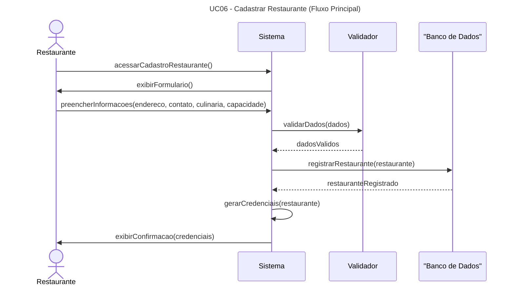
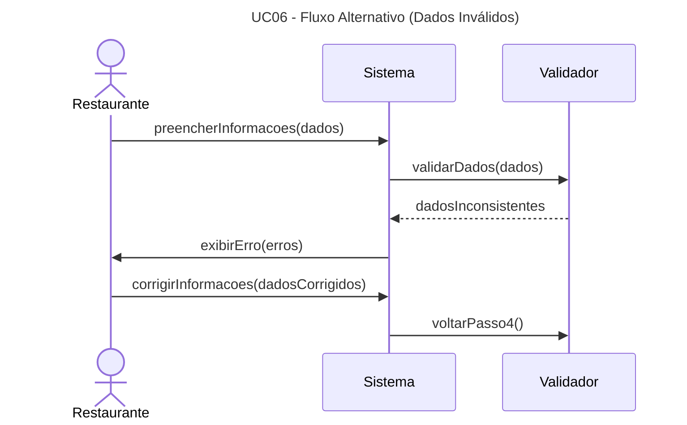

```mermaid
sequenceDiagram
    actor Restaurante
    participant Sistema
    participant Validador
    participant BD as "Banco de Dados"
    
    title: UC06 - Cadastrar Restaurante (Fluxo Principal)
    
    Restaurante->>Sistema: acessarCadastroRestaurante()
    Sistema->>Restaurante: exibirFormulario()
    Restaurante->>Sistema: preencherInformacoes(endereco, contato, culinaria, capacidade)
    Sistema->>Validador: validarDados(dados)
    Validador-->>Sistema: dadosValidos
    Sistema->>BD: registrarRestaurante(restaurante)
    BD-->>Sistema: restauranteRegistrado
    Sistema->>Sistema: gerarCredenciais(restaurante)
    Sistema->>Restaurante: exibirConfirmacao(credenciais)
```

```mermaid
sequenceDiagram
    actor Restaurante
    participant Sistema
    participant Validador

    title: UC06 - Fluxo Alternativo (Dados Inválidos)
    
    Restaurante->>Sistema: preencherInformacoes(dados)
    Sistema->>Validador: validarDados(dados)
    Validador-->>Sistema: dadosInconsistentes
    Sistema->>Restaurante: exibirErro(erros)
    Restaurante->>Sistema: corrigirInformacoes(dadosCorrigidos)
    Sistema->>Validador: voltarPasso4()
```
