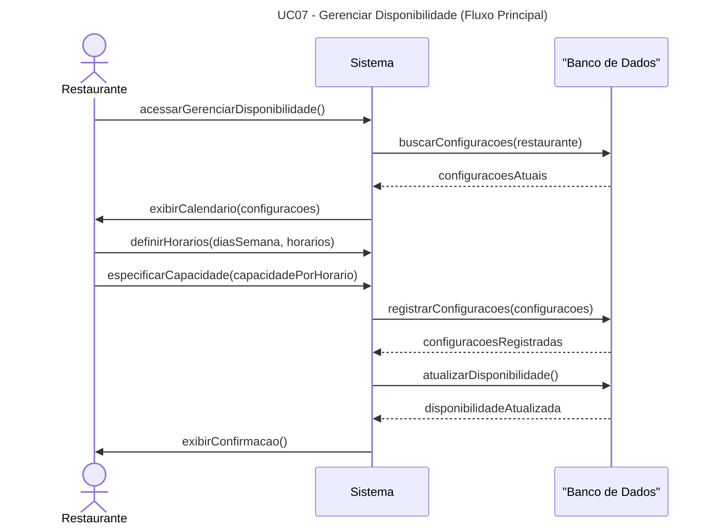
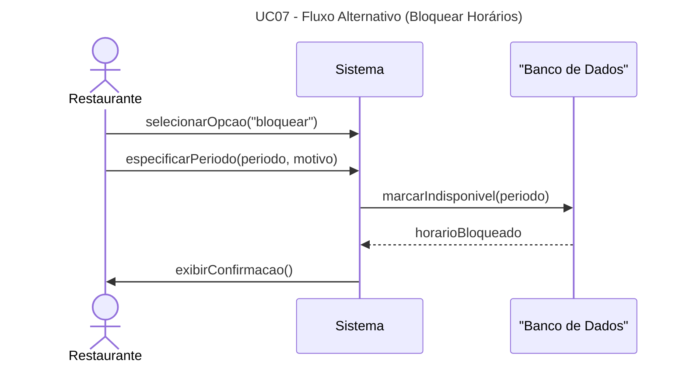

```mermaid
sequenceDiagram
    actor Restaurante
    participant Sistema
    participant BD as "Banco de Dados"
    
    title: UC07 - Gerenciar Disponibilidade (Fluxo Principal)
    
    Restaurante->>Sistema: acessarGerenciarDisponibilidade()
    Sistema->>BD: buscarConfiguracoes(restaurante)
    BD-->>Sistema: configuracoesAtuais
    Sistema->>Restaurante: exibirCalendario(configuracoes)
    Restaurante->>Sistema: definirHorarios(diasSemana, horarios)
    Restaurante->>Sistema: especificarCapacidade(capacidadePorHorario)
    Sistema->>BD: registrarConfiguracoes(configuracoes)
    BD-->>Sistema: configuracoesRegistradas
    Sistema->>BD: atualizarDisponibilidade()
    BD-->>Sistema: disponibilidadeAtualizada
    Sistema->>Restaurante: exibirConfirmacao()
```

```mermaid
sequenceDiagram
    actor Restaurante
    participant Sistema
    participant BD as "Banco de Dados"

    title: UC07 - Fluxo Alternativo (Bloquear Horários)
    
    Restaurante->>Sistema: selecionarOpcao("bloquear")
    Restaurante->>Sistema: especificarPeriodo(periodo, motivo)
    Sistema->>BD: marcarIndisponivel(periodo)
    BD-->>Sistema: horarioBloqueado
    Sistema->>Restaurante: exibirConfirmacao()
```
