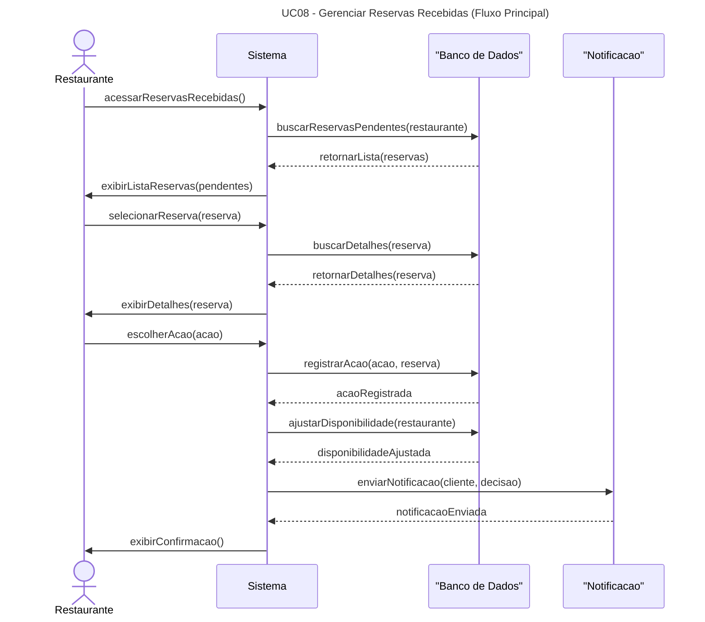
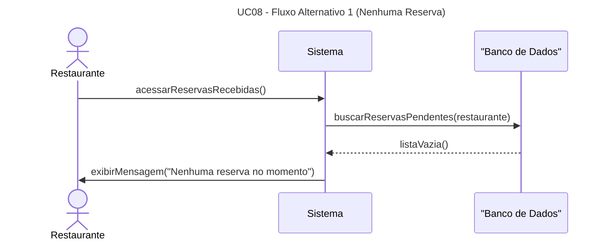
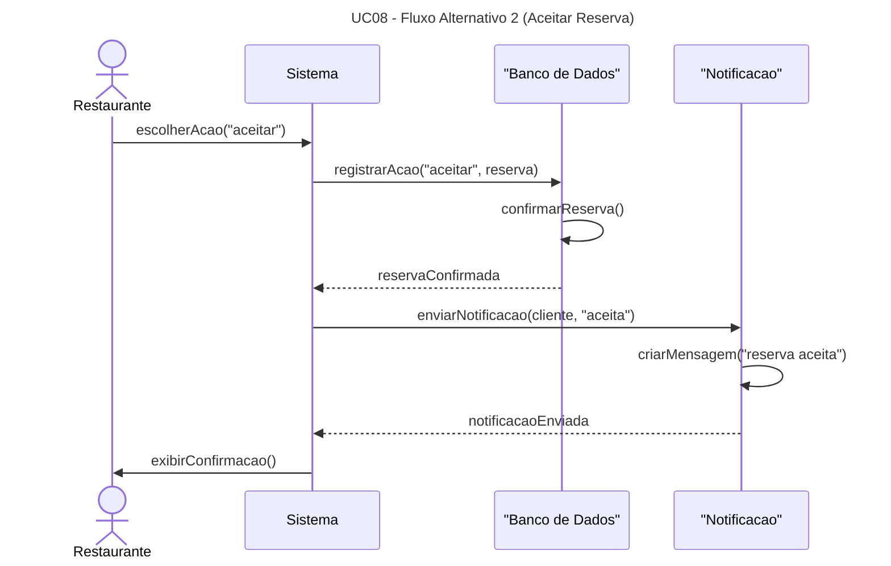
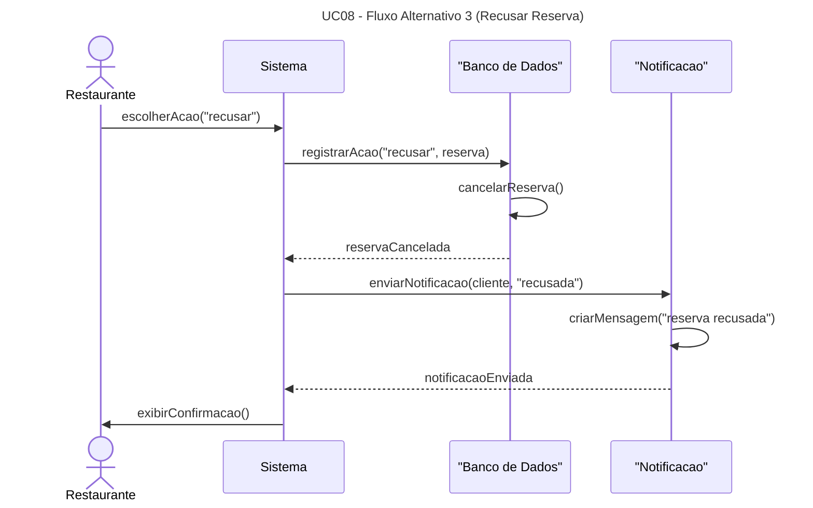

```mermaid
sequenceDiagram
    actor Restaurante
    participant Sistema
    participant BD as "Banco de Dados"
    participant Notif as "Notificacao"
    
    title: UC08 - Gerenciar Reservas Recebidas (Fluxo Principal)
    
    Restaurante->>Sistema: acessarReservasRecebidas()
    Sistema->>BD: buscarReservasPendentes(restaurante)
    BD-->>Sistema: retornarLista(reservas)
    Sistema->>Restaurante: exibirListaReservas(pendentes)
    Restaurante->>Sistema: selecionarReserva(reserva)
    Sistema->>BD: buscarDetalhes(reserva)
    BD-->>Sistema: retornarDetalhes(reserva)
    Sistema->>Restaurante: exibirDetalhes(reserva)
    Restaurante->>Sistema: escolherAcao(acao)
    Sistema->>BD: registrarAcao(acao, reserva)
    BD-->>Sistema: acaoRegistrada
    Sistema->>BD: ajustarDisponibilidade(restaurante)
    BD-->>Sistema: disponibilidadeAjustada
    Sistema->>Notif: enviarNotificacao(cliente, decisao)
    Notif-->>Sistema: notificacaoEnviada
    Sistema->>Restaurante: exibirConfirmacao()
```

```mermaid
sequenceDiagram
    actor Restaurante
    participant Sistema
    participant BD as "Banco de Dados"

    title: UC08 - Fluxo Alternativo 1 (Nenhuma Reserva)
    
    Restaurante->>Sistema: acessarReservasRecebidas()
    Sistema->>BD: buscarReservasPendentes(restaurante)
    BD-->>Sistema: listaVazia()
    Sistema->>Restaurante: exibirMensagem("Nenhuma reserva no momento")
```

```mermaid
sequenceDiagram
    actor Restaurante
    participant Sistema
    participant BD as "Banco de Dados"
    participant Notif as "Notificacao"

    title: UC08 - Fluxo Alternativo 2 (Aceitar Reserva)
    
    Restaurante->>Sistema: escolherAcao("aceitar")
    Sistema->>BD: registrarAcao("aceitar", reserva)
    BD->>BD: confirmarReserva()
    BD-->>Sistema: reservaConfirmada
    Sistema->>Notif: enviarNotificacao(cliente, "aceita")
    Notif->>Notif: criarMensagem("reserva aceita")
    Notif-->>Sistema: notificacaoEnviada
    Sistema->>Restaurante: exibirConfirmacao()
```

```mermaid
sequenceDiagram
    actor Restaurante
    participant Sistema
    participant BD as "Banco de Dados"
    participant Notif as "Notificacao"

    title: UC08 - Fluxo Alternativo 3 (Recusar Reserva)
    
    Restaurante->>Sistema: escolherAcao("recusar")
    Sistema->>BD: registrarAcao("recusar", reserva)
    BD->>BD: cancelarReserva()
    BD-->>Sistema: reservaCancelada
    Sistema->>Notif: enviarNotificacao(cliente, "recusada")
    Notif->>Notif: criarMensagem("reserva recusada")
    Notif-->>Sistema: notificacaoEnviada
    Sistema->>Restaurante: exibirConfirmacao()
```
