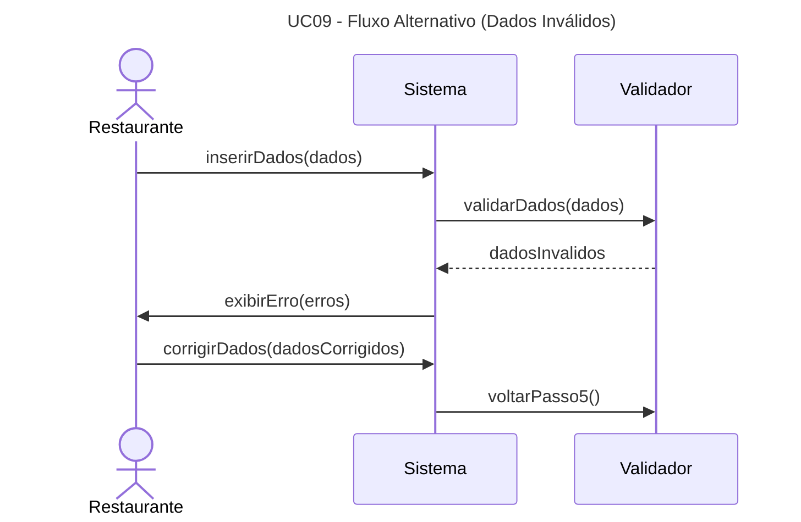

```mermaid
sequenceDiagram
    actor Restaurante
    participant Sistema
    participant Validador

    title: UC09 - Fluxo Alternativo (Dados Inválidos)
    
    Restaurante->>Sistema: inserirDados(dados)
    Sistema->>Validador: validarDados(dados)
    Validador-->>Sistema: dadosInvalidos
    Sistema->>Restaurante: exibirErro(erros)
    Restaurante->>Sistema: corrigirDados(dadosCorrigidos)
    Sistema->>Validador: voltarPasso5()
```
