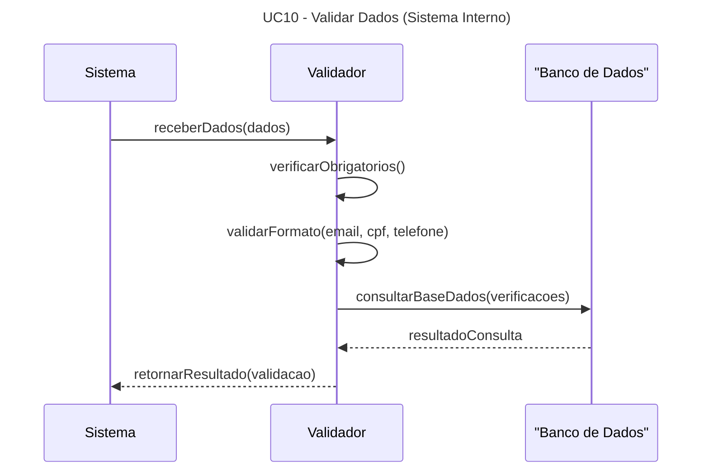

```mermaid
sequenceDiagram
    participant Sistema
    participant Validador
    participant BD as "Banco de Dados"
    
    title: UC10 - Validar Dados (Sistema Interno)
    
    Sistema->>Validador: receberDados(dados)
    Validador->>Validador: verificarObrigatorios()
    Validador->>Validador: validarFormato(email, cpf, telefone)
    Validador->>BD: consultarBaseDados(verificacoes)
    BD-->>Validador: resultadoConsulta
    Validador-->>Sistema: retornarResultado(validacao)
```
