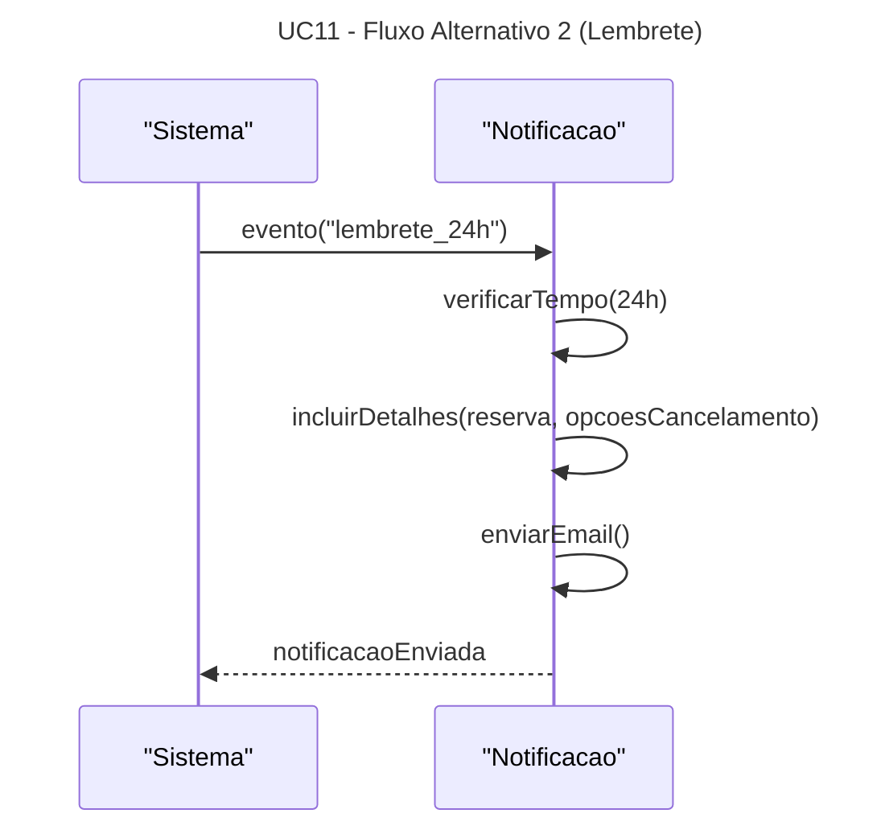
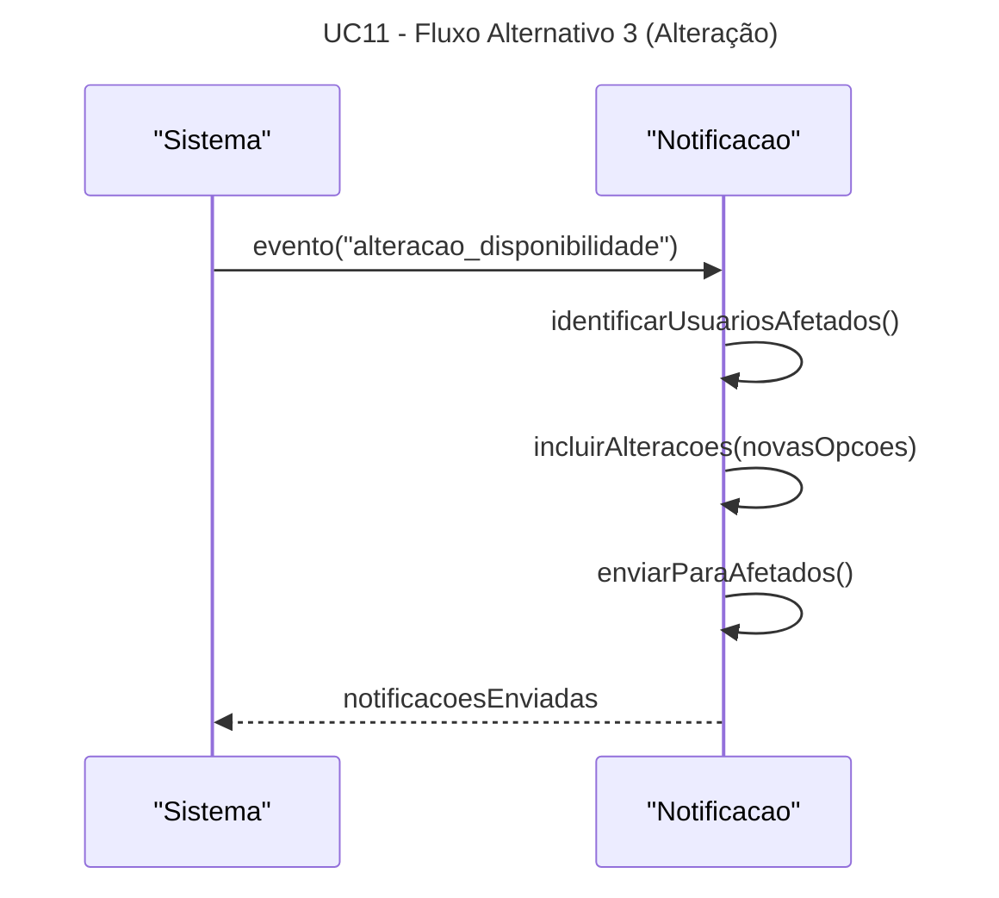

```mermaid
sequenceDiagram
    participant Sistema as "Sistema"
    participant Notif as "Notificacao"

    title: UC11 - Fluxo Alternativo 2 (Lembrete)

    Sistema->>Notif: evento("lembrete_24h")
    Notif->>Notif: verificarTempo(24h)
    Notif->>Notif: incluirDetalhes(reserva, opcoesCancelamento)
    Notif->>Notif: enviarEmail()
    Notif-->>Sistema: notificacaoEnviada
```

```mermaid
sequenceDiagram
    participant Sistema as "Sistema"
    participant Notif as "Notificacao"

    title: UC11 - Fluxo Alternativo 3 (Alteração)

    Sistema->>Notif: evento("alteracao_disponibilidade")
    Notif->>Notif: identificarUsuariosAfetados()
    Notif->>Notif: incluirAlteracoes(novasOpcoes)
    Notif->>Notif: enviarParaAfetados()
    Notif-->>Sistema: notificacoesEnviadas
```
